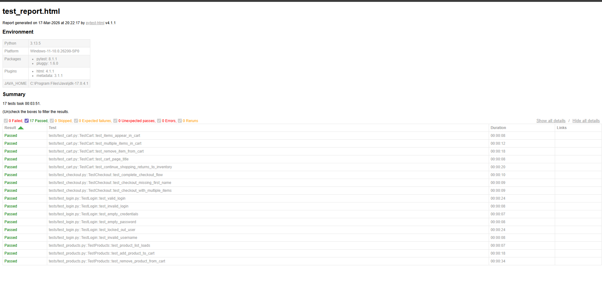

# 🧪 Selenium Automation Testing Framework

A professional-grade web application test automation framework built with
**Python · Selenium WebDriver · PyTest · Page Object Model**.

Automates end-to-end testing for [SauceDemo](https://www.saucedemo.com) —
a publicly available e-commerce demo site used for QA practice.

---

## 📋 Table of Contents

- [Tech Stack](#tech-stack)
- [Project Structure](#project-structure)
- [Prerequisites](#prerequisites)
- [Installation](#installation)
- [Running Tests](#running-tests)
- [Generating HTML Reports](#generating-html-reports)
- [Test Coverage](#test-coverage)
- [Framework Architecture](#framework-architecture)
- [CI/CD with GitHub Actions](#cicd-with-github-actions)

---

## 🛠️ Tech Stack

| Technology | Version | Purpose |
|---|---|---|
| Python | 3.11+ | Programming language |
| Selenium WebDriver | 4.27+ | Browser automation engine |
| PyTest | 8.1+ | Test runner and assertion library |
| pytest-html | 4.1+ | HTML test report generation |
| WebDriver Manager | 4.0+ | Automatic ChromeDriver management |
| Page Object Model | — | Design pattern for maintainability |

---

## 📁 Project Structure

```
automation-testing-framework/
│
├── tests/                        ← Test scripts (one file per module)
│   ├── test_login.py             │  6 login test cases
│   ├── test_products.py          │  3 product/inventory test cases
│   ├── test_cart.py              │  5 cart test cases
│   └── test_checkout.py          │  3 checkout test cases
│
├── pages/                        ← Page Object Model classes
│   ├── base_page.py              │  Shared helpers (wait, click, type)
│   ├── login_page.py             │  Login page interactions
│   ├── inventory_page.py         │  Product listing page
│   ├── cart_page.py              │  Shopping cart page
│   └── checkout_page.py          │  3-step checkout flow
│
├── utils/                        ← Framework utilities
│   ├── driver_setup.py           │  WebDriver factory + WinError-193 fix
│   └── config.py                 │  Centralised test configuration
│
├── reports/                      ← Generated reports (auto-created)
│
├── conftest.py                   ← PyTest fixtures (setup/teardown)
├── pytest.ini                    ← PyTest configuration
├── requirements.txt              ← Python dependencies
└── README.md
```

---

## ⚙️ Prerequisites

- **Python 3.11+** — [python.org](https://www.python.org/downloads/)
- **Google Chrome** — latest version
- **Git** — [git-scm.com](https://git-scm.com/)

---

## 🚀 Installation

```bash
# 1. Clone the repository
git clone https://github.com/YOUR_USERNAME/automation-testing-framework.git
cd automation-testing-framework

# 2. Create and activate a virtual environment
python -m venv venv

# Windows
venv\Scripts\activate

# Mac / Linux
source venv/bin/activate

# 3. Install all dependencies
pip install -r requirements.txt
```

> ChromeDriver is downloaded **automatically** by webdriver-manager —
> no manual driver setup required.

---

## ▶️ Running Tests

```bash
# Run the full test suite
pytest

# Run with verbose output (see each test name)
pytest -v

# Run a specific module
pytest tests/test_login.py
pytest tests/test_cart.py
pytest tests/test_checkout.py

# Run a single test by name
pytest tests/test_login.py::TestLogin::test_valid_login

# Run tests matching a keyword
pytest -k "login"
pytest -k "cart or checkout"
pytest -k "not locked_out"

# Stop on first failure (fast feedback)
pytest -x

# Show print() output during tests
pytest -s
```

---

## 📊 Generating HTML Reports

```bash
# Run tests AND generate a self-contained HTML report
pytest -v --html=reports/test_report.html --self-contained-html
```

Open `reports/test_report.html` in any browser to see:

- ✅ Passed tests (green)
- ❌ Failed tests (red) with full error messages and stack traces
- 📸 Screenshot links for failed tests (auto-captured)
- ⏱️ Duration for each test
- 🖥️ Environment info (Python version, platform, packages)

---

## 📊 Test Execution Report

The framework generates detailed HTML reports using pytest-html.

### Sample Report Output:



**Summary:**
- Total Tests: 17  
- Passed: 17  
- Failed: 0  
- Execution Time: ~4 minutes

## ✅ Test Coverage

| Module | Test ID | Scenario | Type |
|---|---|---|---|
| **Login** | TC_LOGIN_001 | Valid credentials → inventory page | Positive |
| | TC_LOGIN_002 | Wrong password → error message | Negative |
| | TC_LOGIN_003 | Empty form submission | Negative |
| | TC_LOGIN_004 | Username only, no password | Negative |
| | TC_LOGIN_005 | Locked-out user account | Negative |
| | TC_LOGIN_006 | Invalid username | Negative |
| **Products** | TC_PROD_001 | All 6 products load | Smoke |
| | TC_PROD_002 | Add to cart → badge increments | Positive |
| | TC_PROD_003 | Remove → badge decrements | Positive |
| **Cart** | TC_CART_001 | Added item appears on cart page | Positive |
| | TC_CART_002 | Two items both appear | Positive |
| | TC_CART_003 | Remove from cart page | Positive |
| | TC_CART_004 | Cart page title is correct | Smoke |
| | TC_CART_005 | Continue shopping returns to inventory | Positive |
| **Checkout** | TC_CHK_001 | Complete checkout flow (E2E) | E2E |
| | TC_CHK_002 | Missing first name → validation error | Negative |
| | TC_CHK_003 | Checkout with multiple items | Positive |
| **Total** | | **17 test cases** | |

---

## 🏗️ Framework Architecture

### Page Object Model (POM)

Each web page is a Python class:

```
Test calls method  →  Page Object  →  Selenium  →  Browser
```

**Without POM:** 17 tests all call `driver.find_element(By.ID, "login-button")` directly.
Change the ID → fix in 17 places.

**With POM:** 17 tests all call `login_page.click_login()`.
Change the ID → fix in 1 place (`login_page.py`).

### BasePage Pattern

All Page Object classes inherit from `BasePage` which provides:

```python
self.wait_for_element(locator)    # wait + return element
self.wait_for_clickable(locator)  # wait until enabled + clickable
self.click(locator)               # wait + click
self.type_text(locator, text)     # wait + clear + send_keys
self.get_text(locator)            # wait + return .text
self.is_element_visible(locator)  # returns True/False safely
```

### Explicit Waits vs time.sleep()

```python
# ❌ Bad — always waits 5 seconds even if element appears in 0.1s
time.sleep(5)

# ✅ Good — waits UP TO 10 seconds, proceeds as soon as element is ready
WebDriverWait(driver, 10).until(EC.element_to_be_clickable(locator))
```

Explicit waits make tests **faster** (don't wait when not needed) and
**more reliable** (don't fail if the network is slightly slow).

### Fixture-Based Setup/Teardown

```
conftest.py
  ├── driver           → opens browser → yield → closes browser
  └── logged_in_driver → reuses driver → performs login → yield
```

The `yield` pattern guarantees teardown runs even when tests fail —
browsers are always cleaned up, no orphaned Chrome processes.

### Screenshot on Failure

`conftest.py` uses a PyTest hook (`pytest_runtest_makereport`) to
automatically capture a screenshot at the exact moment any test fails.
Screenshots are saved to `reports/screenshots/` and linked in the HTML report.

---

## 🔄 CI/CD with GitHub Actions

Every push to `main` or `develop` automatically:

1. Checks out the code
2. Installs Chrome
3. Installs Python dependencies
4. Runs the full test suite in headless mode
5. Uploads the HTML report as a downloadable artifact

```yaml
# .github/workflows/test.yml  (already included in this repo)
on:
  push:
    branches: [main, develop]
  pull_request:
    branches: [main]
  schedule:
    - cron: '0 0 * * *'   # nightly run at midnight UTC
```

---

## 🐛 Known Issues & Solutions

| Issue | Cause | Fix |
|---|---|---|
| `WinError 193` | WDM caches wrong file | Run `rmdir /s /q "%USERPROFILE%\.wdm"` then `pip install --upgrade webdriver-manager` |
| `TimeoutException` | Element not found in time | Increase `EXPLICIT_WAIT` in `utils/config.py` |
| `SessionNotCreatedException` | Chrome/ChromeDriver version mismatch | Delete `.wdm` cache; WDM will download correct version |

---

## 👤 Author

Built as a portfolio project demonstrating professional QA automation engineering skills.

**Skills demonstrated:**
- Selenium WebDriver 4.x
- PyTest fixtures and hooks
- Page Object Model design pattern
- Explicit waits and synchronisation
- Negative and positive test design
- CI/CD pipeline integration
- Screenshot capture on failure
- Clean, maintainable, documented code

---

## 📄 License

This project is for educational and portfolio purposes.
